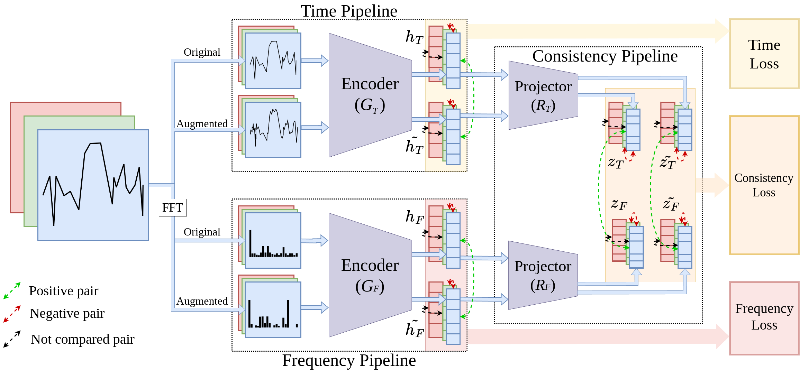
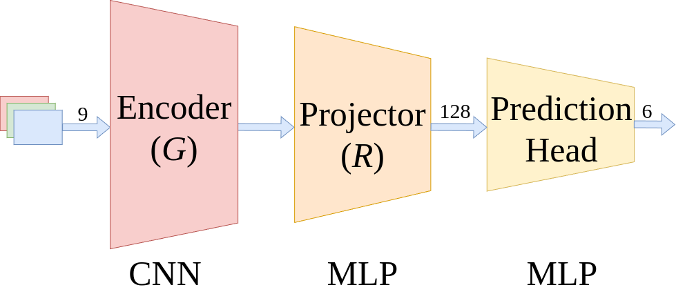
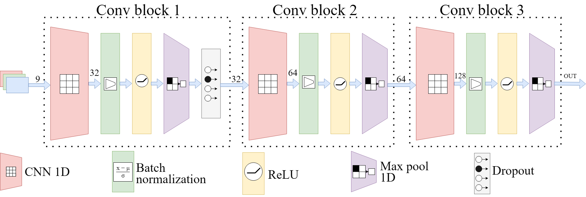
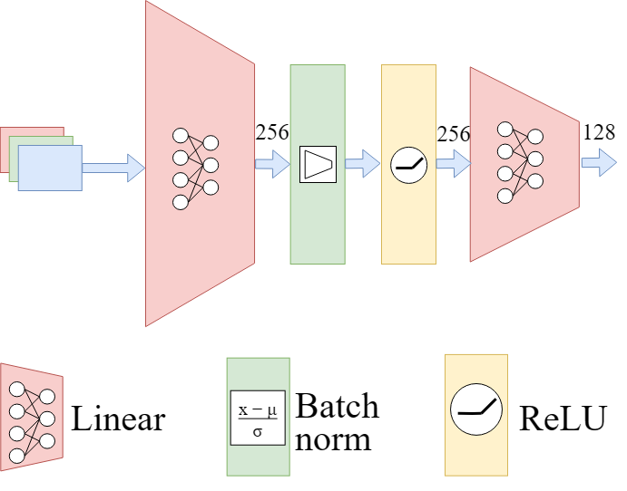
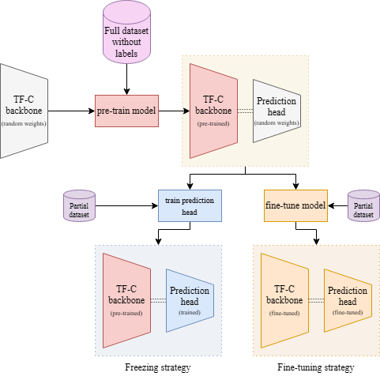
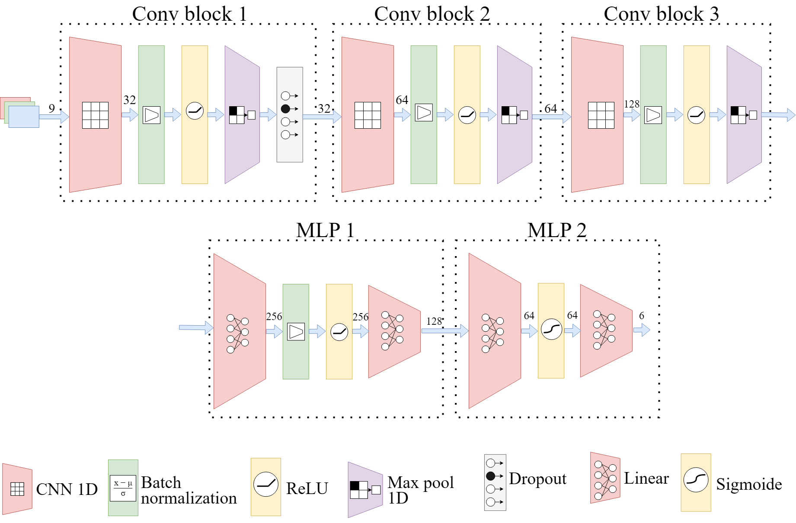

# Self-Supervised Contrastive Pre-Training For Time Series via Time-Frequency Consistency

#### Author: Nicolas Hecker

#### TF-C Original Paper: [NeurIPS 2022](https://openreview.net/forum?id=OJ4mMfGKLN), [Preprint](https://arxiv.org/abs/2206.08496)

## Overview 

This repository contains the code for training finetuning and testing the time-frequency consistency (TF-C) with convolutional neural networks (CNN) and UCI dataset (dataset made by "University of California, Irvine") with differents amounts of data. This work was published on Bracis (Belém - PA - Brasil 2024) conference.

The technique is used for training a CNN model in a pretext unlabeled activity. After that the backbone of trained model is finetuned in a labeled activity of classification, where it is tested and have its metrics reported. This finetuned model is ready for inference for this downstream task.

## Key idea of TF-C

The TF-C is a technique of self-supervised learning (SSL) mainly for time series problems based on a comparison of time domain with frequency domain. This comparison is called consistency and names the technique: Time and frequency consistency. Its archtecture for pre-training (the stage of SSL) is presented on figure below:


<p align="center">
    
</p>

The first step is to get the dataset splited on batches.

After, the Fast Fourier Transform (FFT) and other transformations (described bellow and in the article) are applied on each batch, producing augmented samples on time domain and frequency domain (the for blue arrows reaching the boxes "time pipeline" and "frequency pipeline").

Next, the data are passed separately for the time encoder ($G_T$) producing the embbeding on first latent space $h_T$, from original time, and $\~{h_T}$, from augmented time; and the same for frequency, passing to the frequency encoder ($G_F$) producing $h_F$ and $\~{h_F}$. These data is used to obtain the time-loss and frequency-loss, used to optimize the model in the training stage.

In following, the $h_s$ are passed to time projector ($R_T$) and frequency projector ($R_F$), to generate the embbedings $Z_T$ $\~{Z_T}$ $Z_F$ $\~{Z_F}$. These data in second latent space are used to obtain the consistency loss.

All the losses consider only data on batch, not comparing samples with other batches. Augmented samples, or differents representations of same data are considered positive pair, and are approximated by loss function. Different samples augmentend or not, in time domain or not, are considered negative pairs, and are distanced each other by loss function in latent space.

The model parts otimized by TF-C on this repository are shown on figures bellow.

<p align="center">
    
</p>

This is the summarized structure of the TFC complete model on downstream task (with prediction head).

The time encoder and frequency encoder have the same archtecture:

<p align="center">
    
</p>

The time projector and frequency projector have the same archtecture:

<p align="center">
    
</p>

The process of training is shown in figure bellow:

<p align="center">
    
</p>

The model is pretrained with full train dataset but without labels. The TF-C has no head on the pre-train. This trained model is named backbone and is linked with the prediction head (a MLP). This code only makes the right pipeline, of finetune, but can be adapted to the freezing pipeline easily. The partial labeled dataset is used to train the prediction head with the backbone.

There is also a supervised complete model trained with the same architecture of the complete TFC. The fully parts are shown here:

<p align="center">
    
</p>


## Datasets
The code used on Bracis publication, will use 3 datasets: 2 used for validation of code of original authors (SleepEEG and Epilepsy) and one of Human Activity Recognition (HAR), the UCI, for train and finetune.

(1). **SleepEEG** contains 153 whole-night sleeping Electroencephalography (EEG) recordings that are monitored by sleep cassette. The data is collected from 82 healthy subjects. The 1-lead EEG signal is sampled at 100 Hz. We segment the EEG signals into segments (window size is 200) without overlapping and each segment forms a sample. Every sample is associated with one of the five sleeping patterns/stages: Wake (W), Non-rapid eye movement (N1, N2, N3) and Rapid Eye Movement (REM). After segmentation, we have 371,055 EEG samples. The [raw dataset](https://www.physionet.org/content/sleep-edfx/1.0.0/) is distributed under the Open Data Commons Attribution License v1.0.

(2). **Epilepsy** contains single-channel EEG measurements from 500 subjects. For each subject, the brain activity was recorded for 23.6 seconds. The dataset was then divided and shuffled (to mitigate sample-subject association) into 11,500 samples of 1 second each, sampled at 178 Hz. The raw dataset features 5 different classification labels corresponding to different status of the subject or location of measurement - eyes open, eyes closed, EEG measured in healthy brain region, EEG measured where the tumor was located, and, finally, the subject experiencing seizure episode. To emphasize the distinction between positive and negative samples in terms of epilepsy, We merge the first 4 classes into one and each time series sample has a binary label describing if the associated subject is experiencing seizure or not. There are 11,500 EEG samples in total. To evaluate the performance of pre-trained model on small fine-tuning dataset, we choose a tiny set (60 samples; 30 samples for each class) for fine-tuning and assess the model with a validation set (20 samples; 10 sample for each class). The model with best validation performance is use to make prediction on test set (the remaining 11,420 samples). The [raw dataset](https://repositori.upf.edu/handle/10230/42894) is distributed under the Creative Commons License (CC-BY) 4.0.

(3). **UCI** contains data of 6 different activities as 50Hz in 6 differents sensors (3 axis of gyroscope and 3 of accelerometer), in adiction of 3 axis of acelerometer without gravity removed by high-pass filter, with train and test sets (train used as validation), 7352 samples on train and 2947 in test. The classes are walking, walking upstairs, walking downstairs, sitting, standing, and lying. The samples has all 128 length. The dataset is already shuffled. You can obtain the [raw dataset](https://archive.ics.uci.edu/dataset/240/human+activity+recognition+using+smartphones) Licensed under a Creative Commons Attribution 4.0 International (CC BY 4.0) license.


The following table summarizes the statistics of all these three datasets:

| Scenario # |              | Dataset      | # Samples    | # Channels | # Classes | Length | Freq (Hz) |
| ---------- | ------------ | ------------ | ------------ | ---------- | --------- | ------ | --------- |
| 1          | Pre-training | **SleepEEG** | 371,055      | 1          | 5         | 200    | 100       |
|            | Fine-tuning  | **Epilepsy** | 60/20/11,420 | 1          | 2         | 178    | 174       |
| 2          | Pre-and-fine | **UCI**      | 7352/2947    | 9          | 6         | 128    | 50        |

### How to obtain the data

To obtain the data and run the necessary preprocessing files, just run the shell script download_datasets.sh with the comando `./download_datasets.sh`. You can have permissions errors so just run `chmod +x download_datasets.sh`


## Requirements

Just run the script in your favorite environment and run `pip install -r requirements.txt`. The python version is python3.10.

## Running the code

**Reproduce our TF-C** To pretrain the model with SleepEEG prepared to finetune the model in Epilepsy, use the command inside "code" folder:

`python main.py --training_mode pre_train --pretrain_dataset SleepEEG --target_dataset Epilepsy --epochs 40 --seed 3 --batch 2`

To fine tune this model use:

`python main.py --training_mode fine_tune_test --pretrain_dataset SleepEEG --target_dataset Epilepsy --device cuda`

There are some examples of options in the above commands. To see more options check up the main.py file.

**Reproduce baselines** 
To execute the baseline CNN supervised, just go `cd baselines/CNN-TFC/` and `python main.py`. The default configs are 1.0 of the dataset, 42 of batch size and 10 epochs, resulting in 96% of acuracy

## Citation

If you find this work useful for your research, please consider citing this paper:

```
@INPROCEEDINGS{242132,
    AUTHOR="Nícolas Hecker and Otavio Napoli and Jaime Vargas and Anderson Rocha and Levy Boccato and Edson Borin",
    TITLE="An Analysis of Time-Frequency Consistency in Human Activity Recognition",
    BOOKTITLE="BRACIS 2024 () ",
    ADDRESS="",
    DAYS="23-21",
    MONTH="may",
    YEAR="2024",
    ABSTRACT="This work relies upon raw data to present the time-frequency consistency TF-C evaluation for human activity recognition (HAR). The original paper utilized data for this task in the pretext stage but did not explore its application in the downstream task. An application with a modified TF-C architecture uses HAR data on the downstream task, reporting an accuracy of 64.08%. We propose three experiments. First, we reproduce the original experiment with the epilepsy dataset, comparing the results with the reported ones. Second, we make a performance comparison test using different percentages of data from 0.1% to 100% and report the corresponding accuracy. Finally, we compare the results with supervised Convolutional Neural Networks and the supervised TF-C. This work demonstrates the feasibility of utilizing TF-C to perform HAR as downstream task, achieving an accuracy of 96\% utilizing all data of the training dataset in fine-tuning. Even with just 42 samples of the training dataset, the model achieved an accuracy of 85% and to obtain an accuracy greater than 90% it is only necessary 126 train samples.",
    KEYWORDS="- Knowledge Representation and Reasoning; - Deep Learning; - Machine Learning and Data Mining",
    URL="http://XXXXX/242132.pdf"
}

```


## Miscellaneous

Please send any questions you might have about the code and/or the algorithm to <ra186132@students.ic.unicamp.br>. 


## License

TF-C codebase is released under the MIT license.

